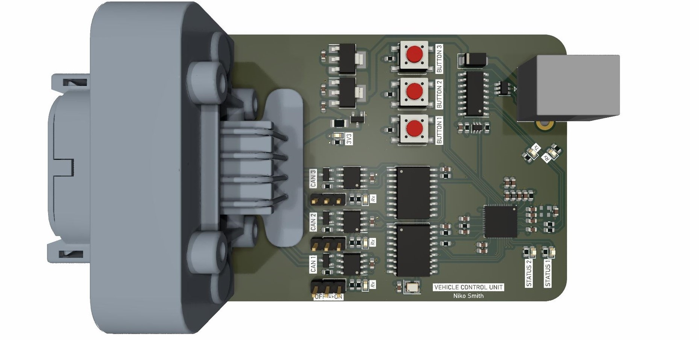

# VehicleVCU - 3 CANBUSs
The VehicleVCU provides three CANBUS transceivers for communication within a vehicle. An ESP32-S2FH4 microcontroller is utilised which has 4kB of flash and one CAN controller. For the other two CANBUSs, two exteral SPI CAN controllers are utilised.

## PCB & Enclosure

## Block Diagram

## PinOut
| First Header  | Second Header |
| ------------- | ------------- |
| Button 1 | IO4 |
| Button 2 | IO3 |
| Button 3 | IO2 |
| STATUS LED 1 | IO38 |
| STATUS LED 2 | IO37 |
| CAN1RX | IO34 |
| CAN1TX | IO35 |
| CAN1_INT | IO36 |
| CAN2_CS | IO21 |
| CAN2_SPI_INT | IO33 |
| CAN3_CS | IO9 |
| CAN3_SPI_INT | IO10 |
| MISO | IO31 |
| MOSI | IO32 |
| SCLK | IO30 |

